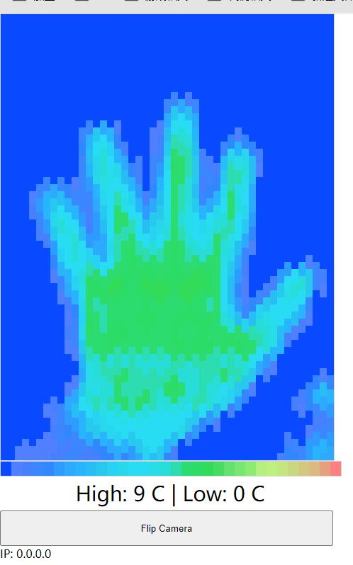

# ESP32S3 IR Temperature Monitor

```
Version:        V1.0
Author:            Vincent
Create Date:    2024/1/23
Note:

```

[TOC]


# Makerfabs

[Makerfabs home page](https://www.makerfabs.com/)

[Makerfabs Wiki](https://wiki.makerfabs.com/)

# ESP32S3 IR Temperature Monitor

## Intruduce

Product Link ：[]()

Wiki Link : []()


## Feature

- Controller: ESP32-S3
- Wireless: WiFi& Bluetooth 5.0
- MLX90640 IR Sensor


# Code

## Complier Option

- Install board : ESP32 .
- Dependency libraries：

```
Version 2.0.0   WiFi
Version 2.0.0   ESPmDNS
Version 2.0.0   Wire
Version 2.16.1   WebSockets_Generic
Version 2.0.0   WiFiClientSecure
```

- Use type-c use cable connect USB to PC.
- Select "ESP32-S3 DEV Module"


## IR Camera WiFi Seriver

Fork from [blackcj/esp32-thermal-camera](https://github.com/blackcj/esp32-thermal-camera)




We modified the pins, adjusted the color display range, and changed to AP mode.

Please connect to the WiFi of Makerfabs_IRCamera_XXXXXX. The password is 12345678

Once connected, please visit 192.168.4.1 and the thermal imaging page will be displayed.

Sometimes due to network card and browser factors can not open normally, please reconnect after a little wait, and repeatedly refresh the page.